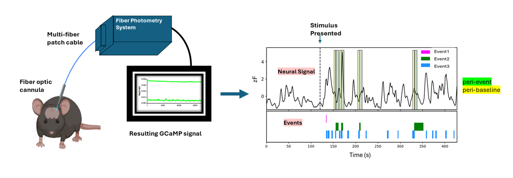

# Photometry Data Analysis and Visualization Repository

This repository contains Python scripts for processing and analyzing photometry data. Designed to streamline data processing, statistical analysis, and visualization, the scripts allow researchers to efficiently gain insights into neural responses associated with specific behaviors. Additional tools are provided for more advanced statistical analyses across complex datasets.

## Table of Contents
- [Experiment Description](#experiment-description)
- [Installation](#installation)
- [Required Folder Structure](#required-folder-structure)
- [Key Features](#key-features)
- [Configuration Settings](#configuration-settings)
- [Quickstart](#quickstart)
- [Script Overview](#script-overview)
    - [Usage](#usage)
- [Troubleshooting](#troubleshooting)

## Experiment Description

This experiment captures neural activity in response to behavioral stimuli using a fiber photometry setup. The system records two signals:
- **470 nm**: Experimental signal reflecting neural activity.
- **410 nm (isosbestic)**: Control signal to correct for motion artifacts.

The workflow aligns these signals with behavioral data, extracting event-specific segments, and performs statistical analyses to explore how neural activity correlates with behaviors like sniffing, grooming, and approaching stimuli.



## Installation

To set up the environment for running these photometry data analysis scripts, install dependencies by running:
```bash
pip install -r requirements.txt
```

## Required Folder Structure

Organize your data files as follows to ensure compatibility with the scripts:
```
root/
├── Virgin Females                          # Defined name for the analysis group
│   ├── 1                                   # Sample ID 1
│   │   ├── 1_split2022-09-20T14_28_47.CSV  # Photometry data file
│   │   └── Raw data-MeP-CRFR2photo_pupblock1-Trial 1 (1).xlsx  # Behavior file
│   ├── 21                                  # Sample ID 21
│   │   ├── 1_split2022-09-28T14_34_01.CSV  # Photometry data file
│   │   └── Raw data-Pup Block 2-Trial 1 (2).xlsx  # Behavior file
├── Archive                                 # Folder for samples to exclude from analysis
└── Videos                                  # Folder for acquisition videos
```

### Folder Descriptions
- **Group Folder** (e.g., "Virgin Females"): Each analysis group should have its own folder, named descriptively.
- **Sample Folders** (e.g., "1", "21"): Each sample has its own folder within the group, containing:
    - A .CSV photometry data file
    - A .xlsx behavior data file
    - Optional files should not end in .CSV or .xlsx to avoid conflicts.


- **Optional Folders**:
    - **Archive**: Store samples to be excluded from analysis.
    - **Videos**: Store acquisition videos if relevant.

## Key Features

This repository provides tools for photometry data analysis, from event-based signal extraction to advanced statistical visualization. Key scripts include:

- **batch_photocode_v2.py**: Processes extract photometry aligned with behavioral events.
- **summarize_values_v2.py**: Generates summarized values for the extracted data.
- **quickplots-stats_v2.py**: Quickly visualizes summarized data with statistical annotations.

## Configuration Settings

The configuration file (`config.yaml`) in the project root directory manages key analysis parameters. This configuration file is required for batch_photocode, summarize_values, and quickplots-stats.

**Configuration Snippet Example**

```yaml
Directory_Information:
  #Parent folder where your data folders are located (It is highly suggested to separate by groups)
  project_home: "/example_data"                            #location where trace folder are stored

Acquisition_Information: 
  behaviorvideo_fps: 30                                    #frames per second of the behavior video
  photometry_fps: 20                                       #frames per second of photometric acquisition
  
  #How many seconds do you want to analyze for peri-events?
  peri-baseline_seconds: 5                                 #will extract x seconds before the event onset
  peri-event_seconds: 10                                   #will extract x seconds after the event onset
```

Use `peri-baseline_seconds` and `peri-event_seconds` to adjust how data segments are extracted for baseline and event time frames.

## Quickstart

To quickly test the scripts with default settings, run:

```bash
python src/batch_photocode_v2.py config.yaml
```

Replace `batch_photocode_v2.py` with other script names (e.g., `summarize_values_v2.py` or `quickplots-stats_v2.py`) to test other functionalities.

## Script Overview
### 1. batch_photocode

The `batch_photocode` script processes photometry traces by normalizing and aligning them with behavioral events, enabling precise analysis of neural responses associated with specific behaviors.

- **Experiment Setup**: Fiber photometry records the 470 nm experimental signal and the 410 nm isosbestic control signal. The script removes motion artifacts by normalizing the 470 nm trace to the 410 nm signal.


- **Behavioral Alignment and Data Extraction**: Aligned traces are segmented by behavior (e.g., sniffing, grooming), with each segment saved in folders organized by behavior type. Additionally, alignment images for each event are generated for easy reference.


### 2. summarize_values

The `summarize_values_v2.py` script aggregates trace segments into summary statistics, saving outputs as `.xlsx` files with multiple metrics:

- **Metrics Calculated**:
    - Area under the curve (AUC)
    - Percent change
    - Z-scores and raw means

This script also applies paired t-tests to compare baseline and event means, annotating significance directly on Z-score figures.

### 3. quickplots-stats

The `quickplots-stats_v2.py` script provides a quick overview of data from `summarize_values` by generating plots with statistical annotations.

- **Examples**:
    - Paired T-Test Example
    - One-Sample T-Test Example


### 4. Advanced Statistical Analysis

For experiments involving multiple sessions, `photo_nestedstats.py` and `Compile_wID_v1.py` enable complex statistical analyses. The `photo_nestedstats.py` script supports nested ANOVA and mixed-effects models:

```python
# Linear mixed model example
model_formula = 'mean_zF ~ C(Stimulus, Treatment(reference="Reference"))'
model = smf.mixedlm(model_formula, df_long, groups=df_long['Mouse_ID'])
result = model.fit()
```

This script allows detailed comparisons across conditions, using nested ANOVA and Tukey tests to assess statistical significance.

## Usage

To run each main script, use the following commands, specifying `config.yaml` as the configuration file:

```bash
# Run batch_photocode
python src/batch_photocode_v2.py config.yaml

# Run summarize_values
python src/summarize_values_v2.py config.yaml

# Run quickplots-stats
python src/quickplots-stats_v2.py config.yaml
```

## Troubleshooting

If you encounter issues, here are some common fixes:

- **Missing Configuration File**: Ensure `config.yaml` is in the project root and contains required parameters. If missing, the script will not execute properly.
- **Incorrect Folder Structure**: Verify that the folder structure follows the format in the Required Folder Structure section. Misplaced files may cause processing errors.
- **Dependencies Not Installed**: Run `pip install -r requirements.txt` if you encounter missing library errors.
- **Output Errors in summarize_values or quickplots-stats**: Check that data from `batch_photocode` has been generated correctly and matches the expected file format.
